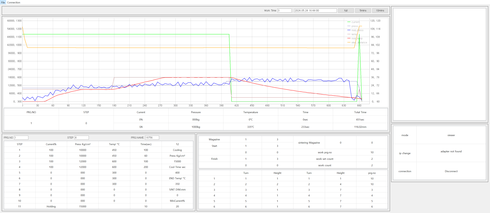

# SinterMonitor
소결기 모니터링

1. 모니터링: PLC에서 값을 읽어 실시간 그래프로 표시, 엑셀로 저장
2. 뷰어: 엑셀 기록을 읽어 그래프로 표시

***

#### view
단일 윈도우(pyqt), 그래프(`pyqtgraph`), 메뉴 바, 다이얼로그, [파이썬 pyqt 템플릿](https://github.com/SuhYeoJee/PythonTemplates/tree/main/pyqt)

#### model
[pymcprotocol](https://github.com/senrust/pymcprotocol), 이더넷 소켓 확인, ip 변경

#### controller
비동기 주기적 실행(QThread, pyqtSlot)

***

### 기능 상세
1. 모니터링
    - plc 연결
    - 시작신호 대기 (1초 주기)
    - 그래프 업데이트 (5초 주기)
    - 파일로 저장
    - 동작 종료시 시작신호 대기
2. 뷰어
    - 엑셀 파일 읽기
    - 그래프 표시
    - 그래프 클릭시 해당 위치 값 표에 표시
3. 기타
    - 화면 이미지로 저장, 인쇄

***

> 연결된 PLC를 찾기 위해 커넥터의 MAC 주소를 사용했는데, 다른 방법이 필요

*** 

v1.03 - 그래프 단위 위치 수정, 표머리회색
v1.02 - 로고추가
v1.01
v1.0